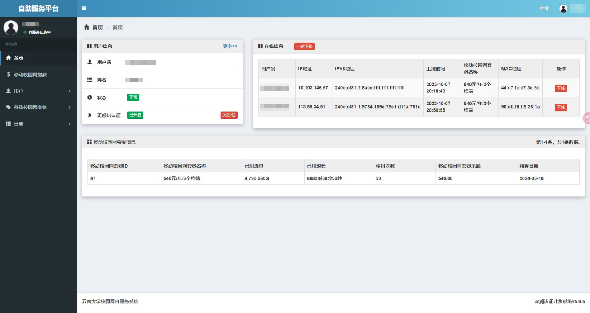
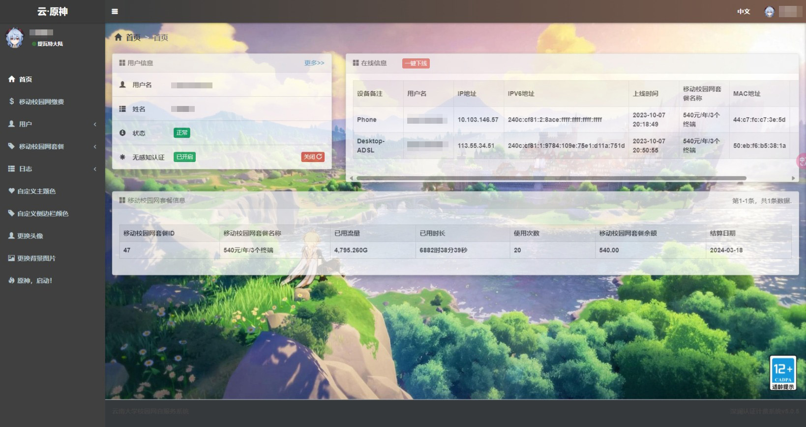
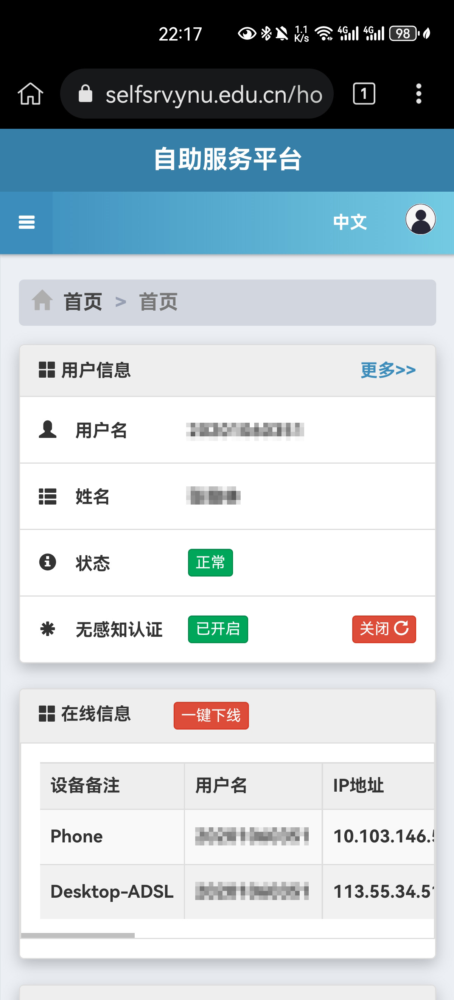
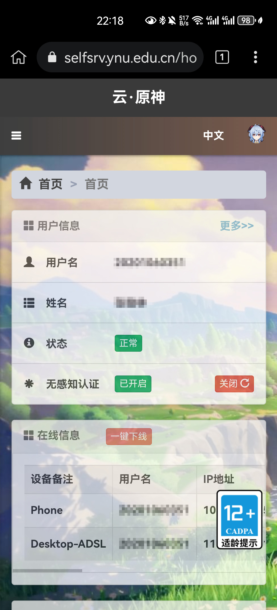

# JavaScript脚本

## 目录

* [云南大学校园网美化](#云南大学校园网美化)

## [云南大学校园网美化](./YNU-selfsrv-enhance.js)

> 对云南大学校园网([自助服务平台](https://selfsrv.ynu.edu.cn))进行界面优化的脚本

### 功能

* 在**首页/在线信息**和**日志/上网明细**中显示无感知认证的设备备注名
* 自定义头像图片(支持图片直链或上传本地图片)
* 自定义背景图(同上)
* 自定义主题色
* 自定义侧边栏颜色
* 一键原神主题

### 效果

|设备|Before|After|
|:-:|:-:|:-:|
|电脑|||
|手机|||

### 环境要求

* 包括但不限于[Tampermonkey](https://www.tampermonkey.net/)、[Violentmonkey](https://violentmonkey.github.io/)、[脚本猫](https://scriptcat.org/)等支持JavaScript脚本的浏览器插件

### 如何安装

1. 打开本脚本的Greasyfork页面：[云南大学校园网美化](https://greasyfork.org/zh-CN/scripts/476284-%E4%BA%91%E5%8D%97%E5%A4%A7%E5%AD%A6%E6%A0%A1%E5%9B%AD%E7%BD%91%E7%BE%8E%E5%8C%96)
2. 点击`安装此脚本`

### Changelog

* 2023-09-28 Version 1.0
  * 完成基本功能
* 2023-10-07 Version 1.1
  * 修复在移动端上无法显示背景图片的问题
  * 增添一键原神主题功能
  * 较大程度重构代码，规范格式
