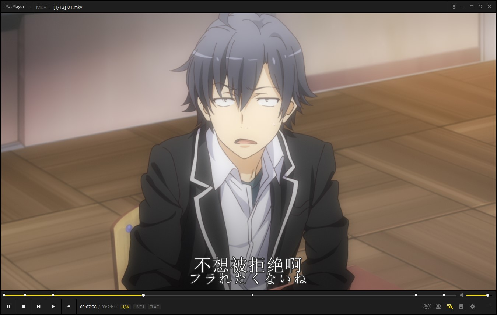
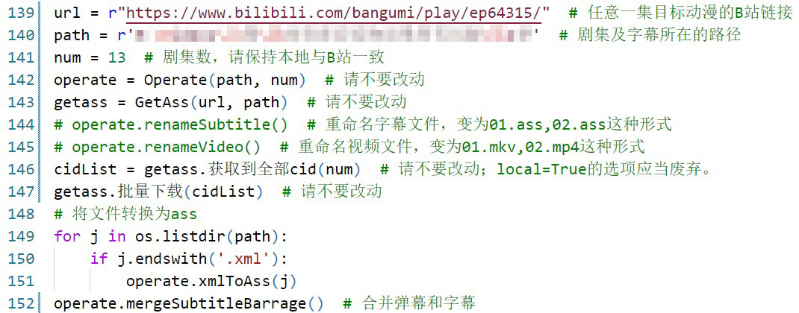
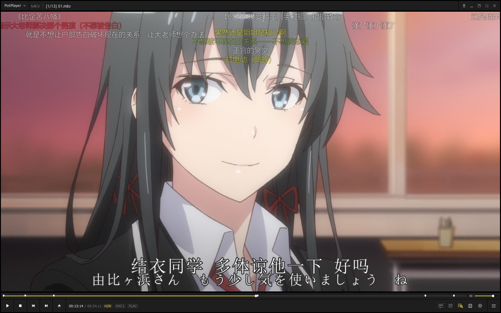
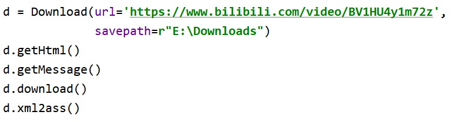
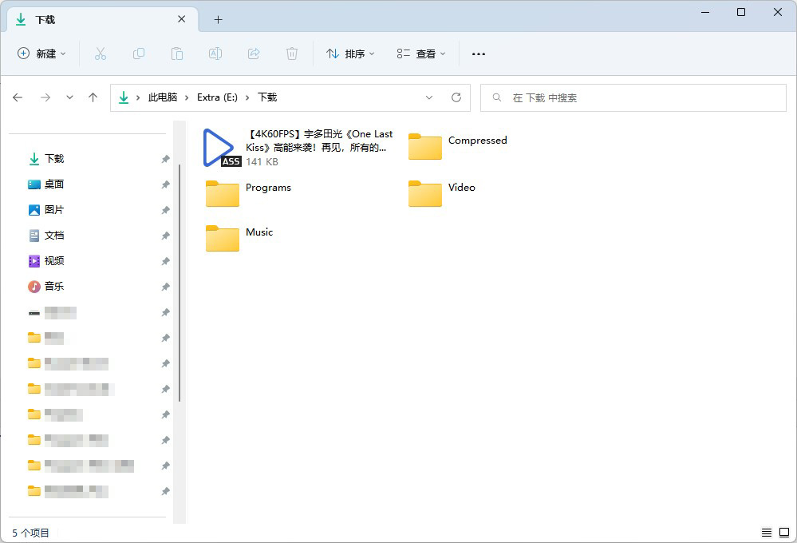
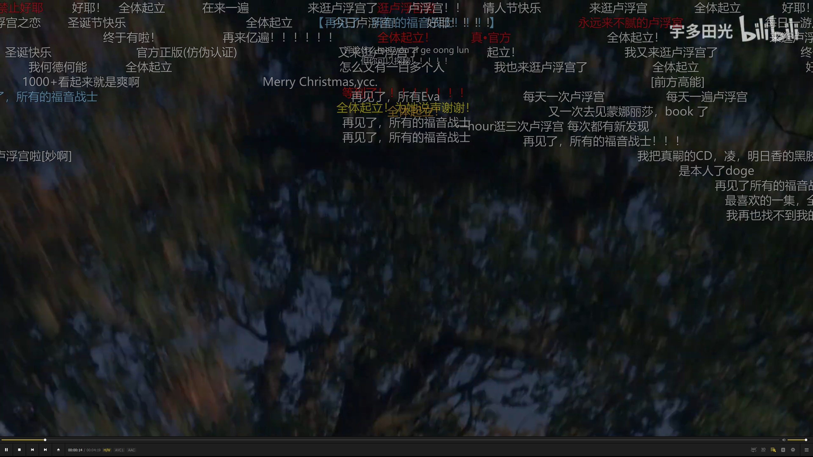

# Bilibili_Batch

## 目录

* [Bilibili\_Batch](#bilibili_batch)
  * [目录](#目录)
  * [1-下载B站动漫弹幕.py](#1-下载b站动漫弹幕py)
    * [1-环境要求](#1-环境要求)
    * [1-环境配置](#1-环境配置)
    * [1-用法](#1-用法)
    * [1-注意事项](#1-注意事项)
  * [2-下载B站视频弹幕.py](#2-下载b站视频弹幕py)
    * [2-环境要求](#2-环境要求)
    * [2-环境配置](#2-环境配置)
    * [2-用法](#2-用法)
    * [2-常见问题](#2-常见问题)

## 1-[下载B站动漫弹幕.py](./下载B站动漫弹幕.py)

* 使用Python获取Bilibili动漫的弹幕xml文件，并将其转换为ass文件以便于本地视频播放器使用。
* 借鉴并使用了[m13253/danmaku2ass: Convert comments from Niconico/AcFun/bilibili to ASS format](https://github.com/m13253/danmaku2ass/)中danmaku2ass.py文件（在本库中更名为xml2ass.py）。
* 基本功能与[下载B站视频弹幕.py](./Bilibili_Batch/下载B站视频弹幕.py)类似，不过该文件中增添了合并动漫外挂字幕和弹幕的功能（该功能直接修改原有的字幕文件，不可恢复，请谨慎使用）

### 1-环境要求

* Python 3
* BeautifulSoup4
* xml2ass.py

### 1-环境配置

* requests
  * 在PowerShell输入`pip install requests`（不过这个库好像是Python解释器自带的）
* BeautifulSoup4
  * 在PowerShell输入`pip install BeautifulSoup4`
* xml2ass.py
  * 下载[xml2ass.py](./Bilibili_Batch/xml2ass.py)文件或在原作者的项目中下载[danmaku2ass.py](https://github.com/m13253/danmaku2ass/blob/master/danmaku2ass.py)文件并将其改名均可

### 1-用法

* 首先本地已有13集的视频，外挂字幕只允许为`ass`格式(关于文件命名，这里重命名过了，不过BD名称例如`[Kamigami&VCB-Studio] Yahari Ore no Seishun Lovecome wa Machigatte Iru. Zoku [01][Ma10p_1080p][x265_flac].mkv`也是可以的)
  * 
  * 
* 找到你想合并的番剧（以下以[《我的青春恋爱物语果然有问题。续》](https://www.bilibili.com/bangumi/play/ep64315/)为例）
  * 
* 随后开始修改代码文件中最后几项的参数
  * `url`：动漫的网页链接(`https://www.bilibili.com/bangumi/play/ep64315/`)
  * `path`：视频及字幕文件的本地路径（`E:/Videos/动漫/我的青春恋爱物语果然有问题/第2季`）
  * `num`：视频剧集数量
  * `operate.renameSubtitle()`：如已经修改成“01.ass”格式的字幕，请注释掉
  * `operate.renameVideo()`：如已经修改成“01.mkv”格式的视频，请注释掉
  * `operate.mergeSubtitleBarrage()`：合并弹幕与字幕，如果并无外挂字幕或不想合并，请注释掉。
  * 所以对于我来说，参数应当这么设置
    
* 最后执行即可
  * 执行过程中，目标路径下会逐渐出现xml文件，当完全下载完成后，将转换为“01_Barrage.ass”的格式，若选择了合并字幕与弹幕，则最后会将01.ass与01_Barrage.ass合并为01.ass，此时即合并完成，即可享受动漫+外挂字幕+弹幕的最佳享受。
  * 

### 1-注意事项

* 如不需要合并字幕与弹幕，请注释掉代码最后一行的`operate.mergeSubtitleBarrage()`，不然会报错(虽然不会对文件产生影响)
* 请确保文件中包含集数的2位数字(例如`[Kamigami&VCB-Studio] Yahari Ore no Seishun Lovecome wa Machigatte Iru. Zoku [01][Ma10p_1080p][x265_flac].mkv`)，代码中是用正则表达式获取序号以匹配，不满足则无法执行。
* 下载的弹幕文件名格式为`\d\d.xml`，随后会转换成`ass`文件，请确保保存路径下没有与之相冲突的`xml`文件，否则有可能会误修改。

> 常见问题

* 若提示`SSLError: HTTPSConnectionPool(host='comment.bilibili.com', port=443)`或`[WinError 10061] 由于目标计算机积极拒绝，无法连接。`，请尝试开启或关闭代理（在`getass.批量下载(cidList)`和`cidList = getass.获取到全部cid(num)`中添加参数`proxies = True`，并修改GetAss类的`self.proxies`为自己的代理端口）

## 2-[下载B站视频弹幕.py](./Bilibili_Batch/下载B站视频弹幕.py)

* 使用Python获取Bilibili视频的弹幕xml文件，并将其转换为ass文件以便于本地视频播放器使用。
* 借鉴并使用了[m13253/danmaku2ass: Convert comments from Niconico/AcFun/bilibili to ASS format](https://github.com/m13253/danmaku2ass/)中danmaku2ass.py文件（在本库中更名为`xml2ass.py`）。

### 2-环境要求

* Python 3
* BeautifulSoup4
* xml2ass.py

### 2-环境配置

* BeautifulSoup4
  * 在PowerShell输入`pip install BeautifulSoup4`
* xml2ass.py
  * 下载[`xml2ass.py`](./Bilibili_Batch/xml2ass.py)文件或在原作者的项目中下载[`danmaku2ass.py`](https://github.com/m13253/danmaku2ass/blob/master/danmaku2ass.py)文件并将其改名均可

### 2-用法

* 找到一份你喜爱的视频(以下以[《One Last Kiss》](https://www.bilibili.com/video/BV1HU4y1m72z)为例)
  * 
* 将链接🔗复制到[下载B站视频弹幕.py](./Bilibili_Batch/下载B站视频弹幕.py)文件中，位于最后的`Download`类的`url`参数中，同时`savepath`参数填写要保存的路径。
  * 
* 运行程序，结束后即可在设置的路径中找到`.ass`文件，名称即为网页名称
  * 
* 此刻即可在本地搭配弹幕和视频一起使用
  * 

### 2-常见问题

* 若提示`FileNotFoundError: [Errno 2] No such file or directory:`，请确保`savepath`文件夹已存在，不然将无法获得弹幕文件。
