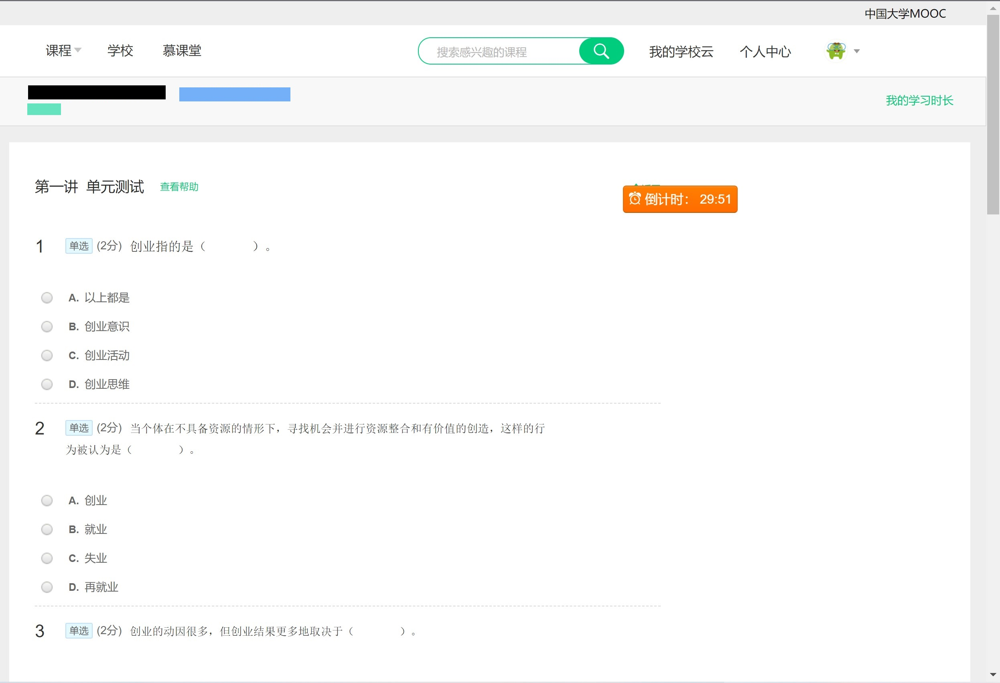

# YNU_大学生创新创业MOOC搜题

## 前排提示

> 这是这个慕课搜题程序的preview版，也就是刚完成基础功能时打包的程序。
>
> 由于这个东西属于我py爬虫的试水作，同时Mooc平台建设的也一般般（主要体现在同类网页元素命名规则混乱的很），所以难免会有一些bug，但是受限于客观原因，这个项目应该不会再维护了。
>
> 就这样，如果有其他同仁希望继续维护以供同学们使用，请随意复制、修改，无需经我同意。
>
> 2023/1/9更新：由于“精华吧”使用重定向更新了反爬机制，无法解决，**目前该程序功能已无法正常使用**。

## 适用于“中国大学MOOC” 云南大学的《大学生创新创业》课程题目查找。下载后按提示自行选择操作方式即可

由于题目页面中，关于题目名称的标签名不太规范，且制作V1.0脚本时题目只开放到前6章，故有可能存在标签名匹配不全的情况，请谅解。
此外，才疏学浅，小程序难免有bug，请不吝指正。

## 全页搜索使用方法

* 由于考试过程中直接访问考试页面会被重定向到课程主页，无法获取到内容，所以需要将网页保存到本地进行解析。
* 保存网页到本地，请选择“网页，完成”模式保存到本地。

* 进入运行环境（此处为Pycharm），运行，依次选择整页搜题并粘贴路径
* 根据保存的页面选择页面类型，请保证选择正确，否则无法获取到题目

**当保存的页面如下所示，为考试后的分析页面时，请选择“分析页面”**
**当保存的页面如下所示，为考试中保存的页面时，请选择“考试页面”**
* 随后只要等待搜索完成即可。

## 感谢这个宝藏网站[精华吧](https://www.jhq8.cn)的题库，无需掏钱登录即可搜题，太强了(。・∀・)ノ

## 新增打包好的exe可执行文件

* 下载地址：[《中国大学MOOC》搜题工具](https://github.com/Steven-Zhl/ScriptToolsLib/releases/tag/YNU_%E5%A4%A7%E5%AD%A6%E7%94%9F%E5%88%9B%E6%96%B0%E5%88%9B%E4%B8%9AMOOC%E6%90%9C%E9%A2%98)，下载完即可使用，使用方式和上述相同
