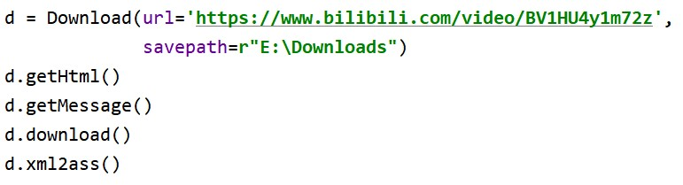
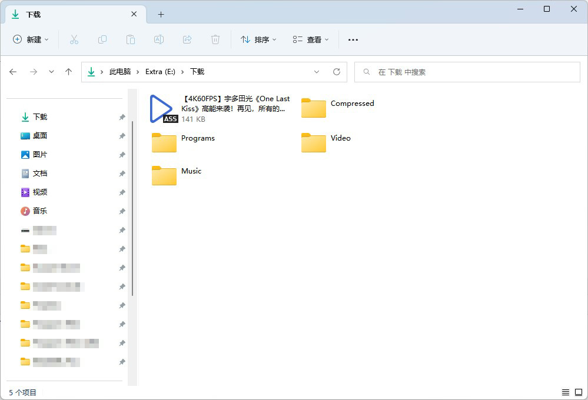

# 脚本及小程序列表

## [M3U8_Decrypt.py](/M3U8_Decrypt.py)
### 介绍：
* 使用Python.Crypto进行文件的AES解密、合并，可以说完全是为了UC下载视频的问题而实现的。
* 曾经在UC上下载视频，格式是m3u8，且使用了AES128加密，使得大多数支持ts格式的视频软件也无法正常播放，只能使用UC播放。不过刚刚发现UC自带转mp4功能了，并且似乎即使原网页使用了AES128加密，下载后的文件仍然是不加密的，所以这个脚本就没什么用了....
### 环境要求：
* Python 3
* Crypto
### 环境配置：
* Crypto：
  * 在Terminal输入 ```pip install crypto```
  * 随后找到解释器路径下的**Lib/site-packages/crypto**，将其名称修改为Crypto
### 用法：
* 不写了，因为甚至找不到一个文件来用这个脚本

## [批量重命名文件.py](/%E6%89%B9%E9%87%8F%E9%87%8D%E5%91%BD%E5%90%8D%E6%96%87%E4%BB%B6.py)
### 介绍：
* 使用Python从Excel中获取学生信息，并对文件进行批量重命名
### 环境要求：
* Python 3
* openpyxl
### 环境配置：
* openpyxl：
  * 在Terminal输入 ```pip install openpyxl```
### 用法：
* pass

## [下载B站视频弹幕.py](/%E4%B8%8B%E8%BD%BDB%E7%AB%99%E8%A7%86%E9%A2%91%E5%BC%B9%E5%B9%95.py)
### 介绍：
* 使用Python获取Bilibili视频的弹幕xml文件，并将其转换为ass文件以便于本地视频播放器使用。
* 借鉴并使用了[m13253/danmaku2ass: Convert comments from Niconico/AcFun/bilibili to ASS format](https://github.com/m13253/danmaku2ass/)中danmaku2ass.py文件（更名为xml2ass.py）。
### 环境要求：
* Python 3
* BeautifulSoup4
* xml2ass.py
### 环境配置：
* BeautifulSoup4
  * 在Terminal输入```pip install BeautifulSoup4```
* xml2ass.py
  * 下载[xml2ass.py](xml2ass.py)文件或在原作者的项目中下载[danmaku2ass.py](https://github.com/m13253/danmaku2ass/blob/master/danmaku2ass.py)文件并将其改名均可
### 用法：
* 找到一份你喜爱的视频（以下以[《One Last Kiss》](https://www.bilibili.com/video/BV1HU4y1m72z)）为例
  * 
* 将链接🔗复制到[下载B站视频弹幕.py](/%E4%B8%8B%E8%BD%BDB%E7%AB%99%E8%A7%86%E9%A2%91%E5%BC%B9%E5%B9%95.py)文件中，位于最后的```Download```类的```url```参数中，同时```savepath```参数填写要保存的路径。
  * 
* 运行程序，结束后即可在设置的路径中找到```.ass```文件，名称即为网页名称
  * 
* 此刻即可在本地搭配弹幕和视频一起使用
  * 
### 常见问题
* 若提示```FileNotFoundError: [Errno 2] No such file or directory: ```，请确保```savepath```文件夹已存在，不然将无法获得弹幕文件。

## [下载B站动漫弹幕.py](/%E4%B8%8B%E8%BD%BDB%E7%AB%99%E5%8A%A8%E6%BC%AB%E5%BC%B9%E5%B9%95.py)
### 介绍：
* 使用Python获取Bilibili动漫的弹幕xml文件，并将其转换为ass文件以便于本地视频播放器使用。
* 借鉴并使用了[m13253/danmaku2ass: Convert comments from Niconico/AcFun/bilibili to ASS format](https://github.com/m13253/danmaku2ass/)中danmaku2ass.py文件（更名为xml2ass.py）。
### 环境要求：
* Python 3
* BeautifulSoup4
* xml2ass.py
### 环境配置：
* BeautifulSoup4
  * 在Terminal输入```pip install BeautifulSoup4```
* xml2ass.py
  * 下载[xml2ass.py](xml2ass.py)文件或在原作者的项目中下载[danmaku2ass.py](https://github.com/m13253/danmaku2ass/blob/master/danmaku2ass.py)文件并将其改名均可
### 用法：
* pass

## [PowerfulPixivDownloadHelper.py](/PowerfulPixivDownloadHelper.py)
### 介绍：
* 辅助Chrome插件“Powerful Pixiv Downloader”的脚本，将该插件导出的记录按照游戏分类，复制到新的xlsx文件中
### 环境要求：
* Python 3
* openpyxl
### 环境配置：
* openpyxl： pip install openpyxl
### 用法：
* pass
### 常见问题
* 若提示```PermissionError: [Errno 13] Permission denied:```，请确保：(1) 原```.xlsx```文件已关闭；(2)原```.xlsx```文件并未被隐藏；以上两种情况均会造成无法将修改应用到原```.xlsx```文件，但新生成的```.xlsx```文件则不受影响。

## [《大学生创新创业》搜题工具.exe（已迁移）](https://github.com/Steven-Zhl/YNU_DaChuang_MOOC)
### 介绍：
* 使用pyinstaller将解析题目的爬虫和搜索题目的Python源文件打包生成的文件
### 环境要求：
* Windows
### 环境配置：
* 无
### 用法：
* 需要提前将《大学生创新创业》的考试页面保存到本地
* 双击直接运行
* 按提示依次输入考试页面的地址并选择模式
* 等待输出答案

## 一键关机.bat
### 介绍：
* 使用cmd命令立刻执行关机命令
### 环境要求：
* Windows
* cmd
* Powershell
### 环境配置：
* 无
### 用法：
* 双击直接运行
* cmd环境下，直接键入文件路径
* Powershell环境下，键入'cmd /c "[文件路径]"'

## 一键关机.exe
### 介绍：
* 将上面这个bat使用msvc编译后的结果
### 环境要求：
* Windows
### 环境配置：
* 无
### 用法：
* 双击直接运行

# 电池状态报告.bat
### 介绍：
* 使用cmd命令生成电池状态报告文件，并自动打开
### 环境要求：
* Windows
* cmd
* Powershell
### 环境配置：
* 无
### 用法：
* 双击直接运行
* cmd环境下，直接键入文件路径
* Powershell环境下，键入'cmd /c "[文件路径]"'