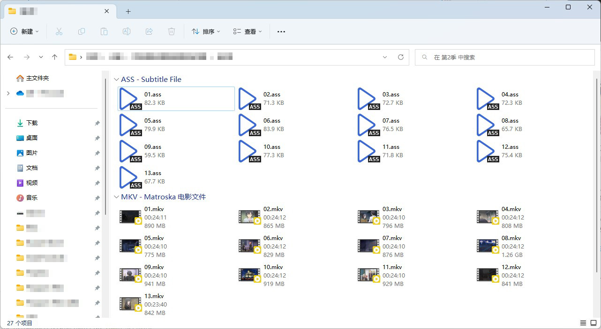
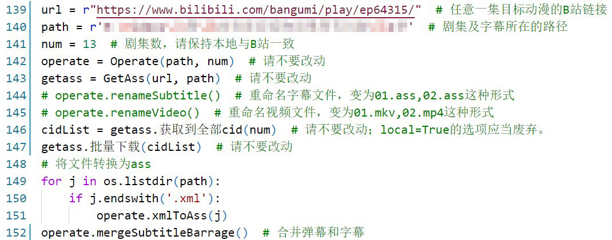
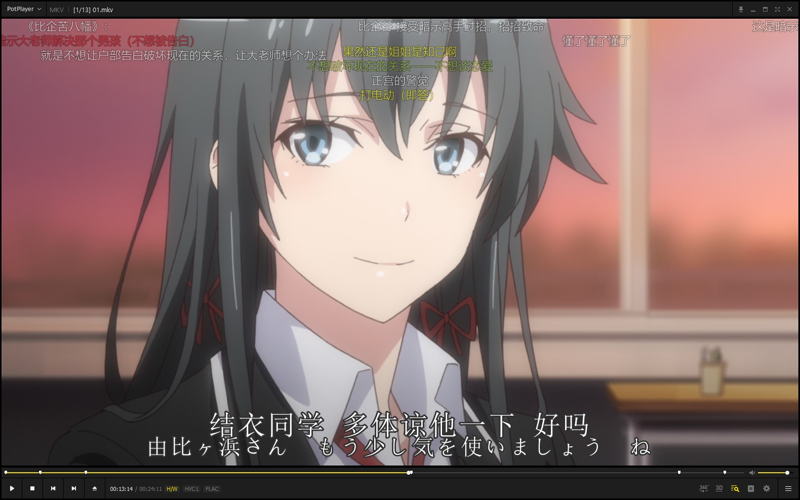
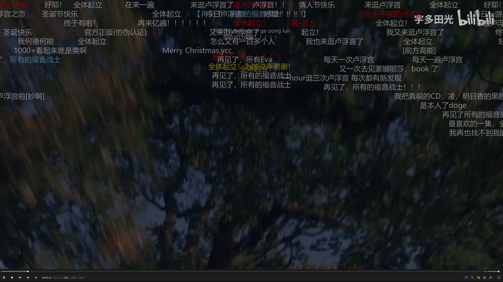

# 脚本工具

> 注意：该库内的程序未进行详细的测试，完全有可能出现各种bug，请谨慎使用。另外，部分文件会有常见问题解答与注意事项，请务必阅读后使用。

## 目录

* [脚本工具](#脚本工具)
  * [目录](#目录)
  * [FxxkChromiumSecurity.py](#fxxkchromiumsecuritypy)
  * [M3U8\_Decrypt.py](#m3u8_decryptpy)
  * [PowerfulPixivDownloadHelper.py](#powerfulpixivdownloadhelperpy)
  * [Powershell\&Cmd常用指令.md](#powershellcmd常用指令md)
  * [YNU\_TimetableConvert](#ynu_timetableconvert)
  * [YNU\_大学生创新创业MOOC搜题](#ynu_大学生创新创业mooc搜题)
  * [电池状态报告.bat](#电池状态报告bat)
  * [批量重命名文件.py](#批量重命名文件py)
  * [下载B站动漫弹幕.py](#下载b站动漫弹幕py)
  * [下载B站视频弹幕.py](#下载b站视频弹幕py)
  * [一键关机.bat](#一键关机bat)
  * [《大学生创新创业》搜题工具](#大学生创新创业搜题工具)

## [FxxkChromiumSecurity.py](./FxxkChromiumSecurity.py)

* 一个用于显示Chromium浏览器中，账号密码数据库的工具（目前仅限Chrome和Edge，但相信大多数人的主要浏览器都是这两者之一）
* ⚠⚠注意：本文件仅用于学习交流，请勿用作非法用途，所造成的一切后果不承担相关责任。
* （Chromium在账号安全性的保护上有够偷懒，用数据库存账号密码没问题，虽然密码也加密了，但架不住密钥直接放在本地）
* 好在经过测试，这段代码打包时就会被杀毒软件检测到并自动终止打包过程，对于大多数电脑上没有相关环境的人来说暂时不用担心。但也担心万一有人把用到的库独立出来，或有更严格的打包方式，杀毒软件就不一定能防的住了。

> 环境要求

* Python 3
* win32crypt
* cryptography
* base64
* sqlite3
* json

> 用法

* 在Python环境中运行即可

## [M3U8_Decrypt.py](./M3U8_Decrypt.py)

* 使用Python.Crypto进行文件的AES解密、合并，可以说这个脚本完全是为了解决UC下载视频的问题而写的。
* 曾经在UC上下载视频，格式是`m3u8`，且使用了`AES-128`加密，使得大多数本支持`ts`格式的视频软件也无法正常播放。不过刚刚发现UC自带转mp4功能了，并且取消了加密，所以这个脚本就没什么用了....

> 环境要求

* Python 3
* Crypto

> 环境配置

* Crypto：
  * 在PowerShell输入 `pip install crypto`
  * 随后找到解释器路径下的`Lib/site-packages/crypto`，将`crypto`修改为`Crypto`，以便于能够正常调用

> 用法

* 不写了，因为甚至找不到一个文件来用这个脚本

## [PowerfulPixivDownloadHelper.py](./PowerfulPixivDownloadHelper.py)

* 辅助Chrome插件`Powerful Pixiv Downloader`的脚本，将该插件导出的记录按照游戏分类，复制到新的xlsx文件中
* 目前这个脚本功能还很不完善，比较鸡肋，待以后什么时候填填坑吧。

> 环境要求

* Python 3
* openpyxl

> 环境配置

* openpyxl:
  * 在PowerShell中输入`pip install openpyxl`

> 用法

* pass

> 常见问题

* 若提示`PermissionError: [Errno 13] Permission denied:`，请确保：(1) 原xlsx文件已关闭；(2)原xlsx文件并未被隐藏；以上两种情况均会无法将修改应用到原文件，但新生成的文件则不受影响。

## [Powershell&Cmd常用指令.md](./Powershell&Cmd常用指令.md)

* 记录一些常用的Powershell和cmd指令

> 环境要求

* Windows
* cmd
* Powershell

> 环境配置

* 无

> 用法

* 无

## [YNU_TimetableConvert](./YNU_TimetableConvert/)

* 将YNU教务系统中的课程表进行格式转换的脚本，使之适应各种第三方日程类应用

> 环境要求

* Python 3
* openpyxl

> 环境配置

* openpyxl:
  * 在PowerShell中输入`pip install openpyxl`

> 用法

* 详见[Introduction.md](./YNU_TimetableConvert/Introduction.md)

## [YNU_大学生创新创业MOOC搜题](./YNU_大学生创新创业MOOC搜题/)

* 初次玩Python爬虫时做的一个练手程序，当时可以使用“精华吧”搜索“大学生创新创业”MOOC的课后题
* 但是目前，由于该网站增强了反爬手段，已经无法使用了

> 环境要求

* Python 3
* BeautifulSoup4
* urllib3

> 环境配置

* BeautifulSoup4
  * 在PowerShell输入`pip install BeautifulSoup4`
* urllib3
  * 通常自带，没有的话用pip安装即可

> 用法

* 详见本项目的[README.md](./YNU_大学生创新创业MOOC搜题/README.md)

## [电池状态报告.bat](./电池状态报告.bat)

* 使用cmd命令生成电池状态报告文件，并自动打开

> 环境要求

* Windows
* cmd
* Powershell

> 环境配置

* 无

> 用法(3种，任选一种即可)

1. 双击直接运行
2. cmd中，直接输入`bat`文件的路径
3. Powershell中，输入`cmd /c [bat文件路径]`

## [批量重命名文件.py](./批量重命名文件.py)

* 使用Python从Excel中获取学生信息，并对文件进行批量重命名。例如对腾讯收集表中的图片附件进行批量重命名。
* 但目前这个文件功能还太过基础，会考虑在闲暇时增添一些功能的。

> 环境要求

* Python 3
* openpyxl

> 环境配置

* openpyxl：
  * 在PowerShell输入 `pip install openpyxl`

> 用法

* pass

## [下载B站动漫弹幕.py](./Bilibili_Batch/下载B站动漫弹幕.py)

* 使用Python获取Bilibili动漫的弹幕xml文件，并将其转换为ass文件以便于本地视频播放器使用。
* 借鉴并使用了[m13253/danmaku2ass: Convert comments from Niconico/AcFun/bilibili to ASS format](https://github.com/m13253/danmaku2ass/)中danmaku2ass.py文件（在本库中更名为xml2ass.py）。
* 基本功能与[下载B站视频弹幕.py](./Bilibili_Batch/下载B站视频弹幕.py)类似，不过该文件中增添了合并动漫外挂字幕和弹幕的功能（该功能直接修改原有的字幕文件，不可恢复，请谨慎使用）

> 环境要求

* Python 3
* requests
* BeautifulSoup4
* xml2ass.py

> 环境配置

* requests
  * 在PowerShell输入`pip install requests`（不过这个库好像是Python解释器自带的）
* BeautifulSoup4
  * 在PowerShell输入`pip install BeautifulSoup4`
* xml2ass.py
  * 下载[xml2ass.py](./Bilibili_Batch/xml2ass.py)文件或在原作者的项目中下载[danmaku2ass.py](https://github.com/m13253/danmaku2ass/blob/master/danmaku2ass.py)文件并将其改名均可

> 用法

* 首先本地已有13集的视频，外挂字幕只允许为`ass`格式(关于文件命名，这里重命名过了，不过BD名称例如`[Kamigami&VCB-Studio] Yahari Ore no Seishun Lovecome wa Machigatte Iru. Zoku [01][Ma10p_1080p][x265_flac].mkv`也是可以的)
  * 
  * 
* 找到你想合并的番剧（以下以[《我的青春恋爱物语果然有问题。续》](https://www.bilibili.com/bangumi/play/ep64315/)为例）
  * 
* 随后开始修改代码文件中最后几项的参数
  * `url`：动漫的网页链接(`https://www.bilibili.com/bangumi/play/ep64315/`)
  * `path`：视频及字幕文件的本地路径（`E:/Videos/动漫/我的青春恋爱物语果然有问题/第2季`）
  * `num`：视频剧集数量
  * `operate.renameSubtitle()`：如已经修改成“01.ass”格式的字幕，请注释掉
  * `operate.renameVideo()`：如已经修改成“01.mkv”格式的视频，请注释掉
  * `operate.mergeSubtitleBarrage()`：合并弹幕与字幕，如果并无外挂字幕或不想合并，请注释掉。
  * 所以对于我来说，参数应当这么设置
    
* 最后执行即可
  * 执行过程中，目标路径下会逐渐出现xml文件，当完全下载完成后，将转换为“01_Barrage.ass”的格式，若选择了合并字幕与弹幕，则最后会将01.ass与01_Barrage.ass合并为01.ass，此时即合并完成，即可享受动漫+外挂字幕+弹幕的最佳享受。
  * 

> 注意事项

* 如不需要合并字幕与弹幕，请注释掉代码最后一行的`operate.mergeSubtitleBarrage()`，不然会报错(虽然不会对文件产生影响)
* 请确保文件中包含集数的2位数字(例如`[Kamigami&VCB-Studio] Yahari Ore no Seishun Lovecome wa Machigatte Iru. Zoku [01][Ma10p_1080p][x265_flac].mkv`)，代码中是用正则表达式获取序号以匹配，不满足则无法执行。
* 下载的弹幕文件名格式为`\d\d.xml`，随后会转换成`ass`文件，请确保保存路径下没有与之相冲突的`xml`文件，否则有可能会误修改。

> 常见问题

* 若提示`SSLError: HTTPSConnectionPool(host='comment.bilibili.com', port=443)`或`[WinError 10061] 由于目标计算机积极拒绝，无法连接。`，请尝试开启或关闭代理（在`getass.批量下载(cidList)`和`cidList = getass.获取到全部cid(num)`中添加参数`proxies = True`，并修改GetAss类的`self.proxies`为自己的代理端口）

## [下载B站视频弹幕.py](./Bilibili_Batch/下载B站视频弹幕.py)

* 使用Python获取Bilibili视频的弹幕xml文件，并将其转换为ass文件以便于本地视频播放器使用。
* 借鉴并使用了[m13253/danmaku2ass: Convert comments from Niconico/AcFun/bilibili to ASS format](https://github.com/m13253/danmaku2ass/)中danmaku2ass.py文件（在本库中更名为`xml2ass.py`）。

> 环境要求

* Python 3
* BeautifulSoup4
* xml2ass.py

> 环境配置

* BeautifulSoup4
  * 在PowerShell输入`pip install BeautifulSoup4`
* xml2ass.py
  * 下载[`xml2ass.py`](./Bilibili_Batch/xml2ass.py)文件或在原作者的项目中下载[`danmaku2ass.py`](https://github.com/m13253/danmaku2ass/blob/master/danmaku2ass.py)文件并将其改名均可

> 用法

* 找到一份你喜爱的视频(以下以[《One Last Kiss》](https://www.bilibili.com/video/BV1HU4y1m72z)为例)
  * 
* 将链接🔗复制到[下载B站视频弹幕.py](./Bilibili_Batch/下载B站视频弹幕.py)文件中，位于最后的`Download`类的`url`参数中，同时`savepath`参数填写要保存的路径。
  * 
* 运行程序，结束后即可在设置的路径中找到`.ass`文件，名称即为网页名称
  * 
* 此刻即可在本地搭配弹幕和视频一起使用
  * 

> 常见问题

* 若提示`FileNotFoundError: [Errno 2] No such file or directory:`，请确保`savepath`文件夹已存在，不然将无法获得弹幕文件。

## [一键关机.bat](./一键关机.bat)

* 使用cmd命令立刻执行关机命令，很损

> 环境要求

* Windows
* cmd
* Powershell

> 环境配置

* 无

> 用法(3种，任选一种即可)

1. 双击直接运行
2. cmd中，直接输入`bat`文件的路径
3. Powershell中，输入`cmd /c [bat文件路径]`即可

## [《大学生创新创业》搜题工具](https://github.com/Steven-Zhl/YNU_DaChuang_MOOC)

* 使用pyinstaller将解析题目的爬虫和搜索题目的Python源文件打包生成的文件

> 环境要求

* Windows

> 环境配置

* 无

> 用法

* 需要提前将《大学生创新创业》的考试页面保存到本地
* 双击直接运行
* 按提示依次输入考试页面的地址并选择模式
* 等待输出答案
