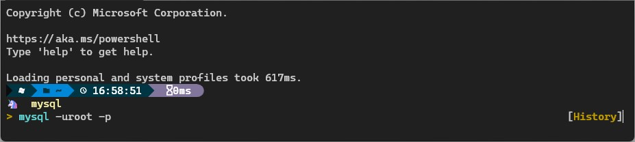

# Powershell&Cmd

## **1. 清屏**

> 该指令仅清除当前窗口的所有内容，不会清除历史记录。

### **Code**

```Powershell
cls
```

## **2. 清除所有输入记录**

> 清理掉所有输入记录（如MySQL操作记录）。这些记录存放在一个txt文件中，所以直接删除该文件即可。

### **Code**

```Powershell
del $env:appdata\Microsoft\Windows\PowerShell\PSReadLine\ConsoleHost_history.txt
```

### **效果显示**

> **Before**
>
> 
>
> **After**
>
> 
